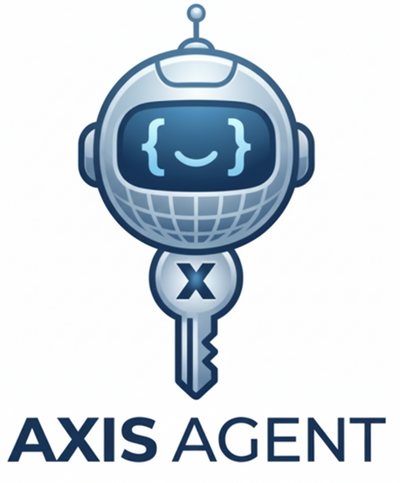

<p align="center">
  
</p>

<p align="center">
  An always-on AI agent powered by the <a href="https://platform.claude.com/docs/en/agent-sdk/overview">Claude Agent SDK</a>.<br>
  Receives messages via Telegram, dispatches them to Claude Code, and returns results.<br>
  General-purpose assistant + task automation.
</p>

---

## Why This Over OpenClaw?

[OpenClaw](https://github.com/openclaw/openclaw) is a popular open-source AI agent (140k+ stars) that connects to messaging platforms. Axis Agent takes a different approach by wrapping Claude Code directly via the Agent SDK:

| | Axis Agent | OpenClaw |
|---|---|---|
| **Token cost** | Uses your Max/Pro plan tokens (included in subscription) | Requires separate API key billing |
| **Always up to date** | Inherits Claude Code's tools, models, and capabilities as they ship | Must wait for OpenClaw maintainers to integrate updates |
| **Tool ecosystem** | Full Claude Code toolset (Read, Write, Edit, Bash, Glob, Grep, WebSearch, WebFetch, Task) + MCP servers + Google Workspace CLI | Custom skills system (ClawHub — with known supply-chain risks from malicious skills) |
| **Security** | Anthropic-managed sandboxing, no third-party skill registry | User-managed Docker sandbox recommended; 386 malicious skills found on ClawHub (Feb 2026) |
| **Complexity** | ~2,300 lines of TypeScript, single Node.js process | Full Docker Compose stack, 4+ GB RAM recommended |
| **LLM lock-in** | Claude only | Multi-provider (Claude, GPT, DeepSeek) |
| **Messaging** | Telegram + HTTP webhook | 10+ platforms (WhatsApp, Slack, Discord, etc.) |

The key advantages:

1. **Zero marginal cost** — if you're already paying for a Claude Max or Pro plan, this agent uses those same tokens at no additional cost. OpenClaw requires a separate API key with per-token billing.
2. **Continuously upgraded engine** — because the agent delegates to Claude Code under the hood, every improvement Anthropic ships to Claude Code (new models, new tools, better sandboxing, performance gains) is inherited automatically. There's no fork to maintain or upstream to track — you always run on the latest Claude Code.

> **Note:** Anthropic's Max plan is licensed for development and personal use only, not production workloads. If you're deploying for production, use the Anthropic API with per-token billing instead.

## Architecture

```
Telegram --> TelegramIntegration --> Agent (Claude Agent SDK) --> Claude
HTTP API --> Fastify Gateway --------^
Cron    --> Scheduler ---------------^
```

The agent runs as a single Node.js process under systemd with security hardening. Health monitoring via GitHub Actions auto-restarts the service or reboots the instance if needed. CI runs build + tests on every push/PR, and Dependabot keeps dependencies updated with auto-merge for patch/minor bumps.

## Features

### Telegram Bot
- **Conversational**: persistent sessions per user, with session resume across restarts
- **Session summaries**: auto-generated for sessions costing ≥$0.05, injected when resuming context
- **Model switching**: `/model opus|sonnet|haiku` to change models per session
- **Cancel/retry**: `/cancel` aborts a running request, `/retry` re-runs the last prompt
- **Cost tracking**: `/cost` shows accumulated usage and per-request averages
- **Media support**: photos (vision), voice messages (with duration), and document uploads
- **Progress indicators**: typing status, ETA based on recent response times, periodic updates every 60s with long-running warning after 5 minutes
- **Inline keyboards**: retry and new session buttons on every response
- **Persistent memory**: `/remember key=value`, `/forget key`, `/memories` — structured facts with categories (personal, work, preference, system, general) and access tracking
- **Reply context**: reply to a specific message to include it as context
- **Voice messages**: voice recordings passed to the agent with duration metadata
- **Stale session recovery**: automatically retries without session ID if a resumed session fails
- **Error classification**: timeout, rate limit, and connection errors shown with specific messages and retry/new session buttons
- **Queue cap**: per-user message queue limited to 5 pending messages to prevent unbounded growth
- **Agent timeout**: configurable execution timeout (default 10 min) aborts hung agent calls

### Scheduled Tasks
- Create via Telegram (`/schedule add`) or HTTP API
- Cron-based scheduling with Australia/Melbourne timezone
- On-demand trigger: `POST /tasks/:id/run` to run any task immediately
- The agent is aware of all scheduled tasks and can trigger them when asked (e.g. "run the email triage task")
- Results sent as Telegram notifications
- Limits: max 20 tasks, minimum 5-minute interval

### Integrations

#### Google Workspace CLI (`gws`) — Primary Google Integration

The agent uses [`@googleworkspace/cli`](https://www.npmjs.com/package/@googleworkspace/cli) as its primary tool for **all Google services**: Gmail, Calendar, Contacts, Drive, Sheets, Docs, and Admin. Authenticated via OAuth token (`~/.config/gws/credentials.json`) with full read/write scopes. A cron job refreshes the token every 3 days to prevent expiry.

#### Composio MCP

[Composio](https://composio.dev/) provides 1000+ third-party integrations via a single HTTP-based MCP server. Used for **non-Google** services only — Google operations should use `gws` instead.

#### Native Trello MCP

Direct Trello API integration via a custom MCP server (`src/trello-mcp-server.ts`). Supports read and write operations: list/search boards, lists, and cards; create/update/archive cards; add comments and checklists; manage labels. Authenticated via API key + token (env vars `TRELLO_API_KEY`, `TRELLO_API_TOKEN`).

#### Custom Skills

For services not covered by Composio or requiring deeper integration:
- **Facebook** — post text and photos to a Facebook Page via Graph API. Photos are auto-optimized before posting (EXIF rotation, exposure/saturation/contrast adjustment, saliency-based smart crop, sharpening). Use `/post` in Telegram after uploading photos.
- **Twilio** — send SMS, make voice calls, and manage phone numbers (AU1 region).
- **Bitwarden** — add, update, or rotate secrets in the Bitwarden vault and sync to the server.
- **Gmail** — fetch, evaluate, archive, and unsubscribe from emails via IMAP with incremental dual-UID watermark triage.

#### Voice Calling (Retell.ai)

Outbound phone calls via Retell.ai SDK with real-time voice AI. Uses a base Retell agent with per-call overrides (`agent_override` + `retell_llm_dynamic_variables`) for dynamic system prompts. LLM: Claude 4.6 Sonnet. STT: Deepgram with `en-AU` locale.

- **Wait-for-human** — `start_speaker: "user"` ensures the AI waits for the recipient to say hello before speaking
- **Natural greetings** — `contextToQuestion()` transforms instruction-style context ("Ask what they're having") into natural spoken questions
- **Agent-initiated calls** — the agent can decide to call someone based on conversation context (confirms with user first, looks up contacts automatically)
- **Telegram integration** — `/call Sean [context]` or `/call +61412345678 [context]` — accepts contact names or phone numbers
- **HTTP API** — `POST /calls` with `{ "phoneNumber": "+61...", "context": "...", "recipientName": "..." }`
- **Call transcripts** — Retell captures structured transcript with word-level timestamps, delivered to Telegram when the call ends
- **Call monitoring** — tracks active calls via status polling, 10-minute safety timeout
- **Voice personality** — uses SOUL.md personality + memory facts for contextual conversations, with owner context (`OWNER_NAME` env var)
- **Voicemail detection** — automatic voicemail message and call termination via `end_call` tool
- **IVR-aware mode** — separate prompt for automated systems (listen-first, DTMF via voice) vs human calls (fast, casual)

Requires: `RETELL_API_KEY`, `RETELL_PHONE_NUMBER`, `RETELL_AGENT_ID`. Optional: `RETELL_VOICE_ID`, `OWNER_NAME`.

#### Google Workspace CLI (`gws`) — Details

Usage: `gws <service> <resource> <method> --params '{...}'` — supports Gmail, Calendar, Contacts (People API), Drive, Sheets, Docs, Admin. Flags: `--json` for request body, `--dry-run` to preview, `--page-all` for auto-pagination. All output is structured JSON. Schema inspection: `gws schema <service.resource.method>`.

#### Playwright MCP (Browser Automation)

Headless Chromium via [@playwright/mcp](https://github.com/microsoft/playwright-mcp). Enables the agent to navigate JS-rendered pages, fill forms, click buttons, take screenshots, and generate PDFs — things WebFetch can't do. The agent automatically chooses WebFetch for static content and Playwright for dynamic/interactive pages.

#### Context7 MCP (Library Documentation)

Up-to-date library documentation lookup via [@upstash/context7-mcp](https://github.com/upstash/context7). Resolves library names to Context7-compatible IDs and fetches current docs and examples on demand, avoiding reliance on potentially outdated training data.

### Memory System
- Structured facts with categories: personal, work, preference, system, general
- Automatic category inference from key names
- SQLite-backed persistence with migration from legacy JSON stores on first load
- Context injection sorted by recency, capped at 30 facts
- Session records with cost tracking, turn counts, and summaries
- Auto-generated session summaries (via Haiku) for sessions costing ≥$0.05, injected when resuming

### Orchestration
- Spawns parallel subagents for complex multi-part tasks
- Chooses model tier per subtask (Opus for reasoning, Sonnet for coding, Haiku for lookups)
- Structured capability routing for adding new integrations (MCP servers → community skills → custom skills → one-off Bash)
- Autonomous skill creation — the agent can generate new skills from conversation using a structured template and learning log

### Self-Modification
- The agent can edit its own source code and redeploy via `scripts/deploy-self.sh`
- Use `/sync-from-instance` locally to pull changes back to the repo

### Health Monitoring
- **GitHub Actions** workflow runs every 30 minutes — checks instance state, SSH connectivity, and service health
- **Post-deploy regression checks** — after every deploy, verifies service health, gateway endpoint, Telegram Bot API connectivity, polling mode, and skill dry-run validation
- **Self-heal script** runs on the instance via systemd timer — restarts the service if it becomes inactive
- **Local health check** script verifies Tailscale, AWS instance state, and peer connectivity

### Skill Testing
- All skill scripts with side effects support `--dry-run` — validates credentials and inputs without calling external APIs
- Post-deploy checks run `--dry-run` on every skill (facebook, twilio, gmail) to verify scripts are functional after deployment
- Credential errors are reported as warnings (expected on fresh instances), while script errors are failures

### Integration Tests
Run `bash scripts/integration-test.sh` against the deployed instance. Tests perform real operations (not dry-run):
- **Service health** — systemd status, gateway `/health`
- **Gateway webhook** — submit prompts via HTTP, verify agent execution
- **Email triage** — IMAP fetch, watermark state
- **Google Contacts** — lookup by name, multi-result search
- **Trello** — list boards, read cards from a board
- **Google Calendar** — iCal fetch (7-day and 30-day windows)
- **Memory/admin** — admin status, job queue, scheduled tasks, metrics
- **Telegram Bot API** — `getMe`, polling mode verification
- **Agent tool use** — verify Bash tool execution end-to-end

### Operations
- Structured JSON logs for easier ingestion into log tooling
- Durable SQLite-backed job queue for webhook and scheduler-triggered runs with per-job timeout and stuck job recovery
- Admin/debug HTTP endpoints: `/admin/status`, `/admin/jobs`, `/admin/events`, `/admin/metrics`

## Installation

### Prerequisites

- Node.js 22+
- A server or VPS (e.g. AWS Lightsail $12/mo)
- Claude Code CLI installed and authenticated (`npm install -g @anthropic-ai/claude-code && claude`)
- A Telegram bot token from [@BotFather](https://t.me/BotFather)
- Your Telegram user ID from [@userinfobot](https://t.me/userinfobot)

### 1. Clone and install

```bash
git clone https://github.com/seansoreilly/axis-agent.git
cd axis-agent
npm install
npm run build
```

### 2. Configure environment

```bash
cp .env.example .env
```

Edit `.env` with general config (ports, model settings, paths). Secrets (API keys, tokens) are managed separately via Bitwarden — see [Secret Management](#secret-management) below.

```bash
PORT=8080
CLAUDE_MODEL=claude-opus-4-6
CLAUDE_MAX_TURNS=25
CLAUDE_MAX_BUDGET_USD=5
CLAUDE_WORK_DIR=/home/ubuntu/workspace
MEMORY_DIR=/home/ubuntu/.claude-agent/memory
CLAUDE_AGENT_TIMEOUT_MS=600000
```

### 3. Authenticate Claude Code on the server

```bash
claude auth login
```

This authenticates with your Max/Pro plan. The Agent SDK inherits this auth — no API key needed.

### 4. Create required directories

The systemd service uses `ProtectHome=read-only` with explicit write paths. These directories must exist before the service starts:

```bash
mkdir -p /home/ubuntu/workspace /home/ubuntu/.claude-agent/memory /home/ubuntu/.claude /home/ubuntu/.config
```

### 5. Install and configure Tailscale (recommended)

The gateway binds to `127.0.0.1` — it is not publicly accessible. Use [Tailscale](https://tailscale.com) to access it remotely:

```bash
curl -fsSL https://tailscale.com/install.sh | sh
sudo tailscale up --hostname=axis-agent
```

Authenticate via the URL printed, then verify:

```bash
tailscale ip -4
```

Enable Tailscale SSH so you can connect without managing SSH keys:

```bash
sudo tailscale set --ssh
```

You can then close all inbound ports on your cloud firewall (including SSH 22) — access is entirely via Tailscale.

### 6. Run directly

```bash
npm start
```

### 7. Run as a systemd service (recommended)

```bash
sudo cp systemd/claude-agent.service /etc/systemd/system/
sudo systemctl daemon-reload
sudo systemctl enable claude-agent
sudo systemctl start claude-agent
```

Check status:

```bash
sudo systemctl status claude-agent
journalctl -u claude-agent -f
```

### Deploy updates

If developing on a local machine, use `deploy.sh` to rsync and restart on the server:

```bash
# Uses Tailscale MagicDNS hostname by default, or override:
DEPLOY_HOST="ubuntu@your-server-ip" ./deploy.sh
```

Every deploy automatically runs post-deploy regression checks (service health, gateway endpoint, Telegram Bot API connectivity, polling mode verification). If any check fails, the deploy exits non-zero.

Use `--self-heal` to enable automatic recovery: on failure, the agent receives the error details via webhook and attempts to diagnose and fix the issue (up to 2 retries). If self-heal is exhausted, a Telegram alert is sent.

```bash
DEPLOY_HOST="ubuntu@your-server-ip" ./deploy.sh --self-heal
```

## Usage

### Telegram Commands

| Command | Description |
|---|---|
| `/start` | Welcome message with command list |
| `/new` | Clear session, start fresh conversation |
| `/cancel` | Abort the current running request |
| `/retry` | Re-run the last prompt |
| `/model [opus\|sonnet\|haiku\|default]` | Switch model for this session |
| `/cost` | Show accumulated usage costs |
| `/schedule add\|remove\|enable\|disable` | Manage scheduled tasks |
| `/tasks` | List all scheduled tasks |
| `/remember key=value` | Store a persistent fact |
| `/forget key` | Remove a fact |
| `/memories` | List all facts |
| `/status` | Show uptime, sessions, model, cost, tasks |
| `/call <name or +number> [context]` | Make an outbound voice call via Retell |
| `/post [notes]` | Create a Facebook post using recently uploaded photos |

Any other message is sent to Claude as a prompt. Sessions persist — follow-up messages maintain conversation context.

### HTTP API

| Endpoint | Method | Description |
|---|---|---|
| `/health` | GET | Health check (returns uptime and timestamp) |
| `/webhook` | POST | Send prompt to agent (`{ "prompt": "...", "sessionId?": "..." }`) |
| `/tasks` | GET | List scheduled tasks |
| `/tasks` | POST | Create scheduled task (`{ "id", "name", "schedule", "prompt" }`) |
| `/tasks/:id` | DELETE | Remove scheduled task |
| `/tasks/:id/run` | POST | Trigger a scheduled task immediately (on demand) |
| `/calls` | POST | Initiate outbound voice call (`{ "phoneNumber": "+61...", "context?": "...", "recipientName?": "..." }`) |
| `/calls/active` | GET | List active voice calls |

## Secret Management

Secrets (API keys, tokens, credentials) are stored in [Bitwarden](https://bitwarden.com/) and synced to the server at deploy time. The `bw` CLI runs **locally only** — your master password never touches the server.

**Setup:**
1. Install the Bitwarden CLI: `npm install -g @bitwarden/cli`
2. Run the one-time migration: `bash scripts/migrate-secrets-to-bitwarden.sh`
3. Sync secrets to server: `bash scripts/sync-secrets.sh` (or `./deploy.sh --sync-secrets`)

**Vault folder:** `claude-agent-lightsail` — each env secret is stored as an individual Secure Note (e.g. `telegram-bot-token`, `gh-token`). JSON credential files (Gmail, Facebook, Google) are stored as separate notes.

**Workflows:**
- **Rotate a secret:** Update the individual entry in Bitwarden → `bash scripts/sync-secrets.sh`
- **Deploy with secrets:** `./deploy.sh --sync-secrets`
- **Rollback:** `bash scripts/rollback-secrets.sh ~/.claude-agent-backup-<timestamp>`

See `CLAUDE.md` for the full secret inventory and `.env.example` for the config vs secrets split.

## Security

- **Secret management**: Secrets stored in Bitwarden vault, synced to server via SCP. Master password never leaves the local machine. Server files are `chmod 600`.
- **Network isolation**: Gateway binds to `127.0.0.1` only — not reachable on public IP. Use Tailscale for remote access.
- **Telegram auth**: Fail-closed — if `TELEGRAM_ALLOWED_USERS` is empty, the service refuses to start. If set, only listed user IDs can interact.
- **Systemd sandboxing**: `ProtectHome=read-only`, `ProtectSystem=strict`, `NoNewPrivileges=true`, `PrivateTmp=true`, with explicit `ReadWritePaths` for required directories.
- **Gateway auth**: Optional `GATEWAY_API_TOKEN` env var enables bearer token authentication on all HTTP endpoints except `/health`. When set, requests must include `Authorization: Bearer <token>`. Token comparison uses timing-safe equality to prevent timing attacks.
- **Security headers**: `@fastify/helmet` adds `X-Content-Type-Options`, `X-Frame-Options`, `Strict-Transport-Security`, and removes `X-Powered-By`.
- **Rate limiting**: `@fastify/rate-limit` — 60 req/min global, 5 req/min on `/webhook`, 3 req/min on `/calls`.
- **Request limits**: Gateway body size capped at 10KB. Scheduler limited to 20 tasks with minimum 5-minute intervals. Per-user message queue capped at 5.
- **Shell injection prevention**: Scheduler check commands are validated for shell metacharacters and executed via `execFile` (no shell interpretation) to prevent injection attacks.
- **Command policy enforcement**: A declarative blocked-command policy prevents destructive operations (`rm -rf /`, `shutdown`, `mkfs`, `curl | bash`, etc.) — enforced both via system prompt and scheduler validation.
- **File permissions**: Credential files written with `mode 0o600` (owner read/write only). SQLite database restricted to `0o600`. Memory directory created with `0o700`.
- **Preflight health checks**: On startup, verifies directory permissions, OAuth credentials, Telegram API connectivity, and SDK write paths — with actionable error messages instead of cryptic failures.
- **Timeout protection**: Agent calls abort after configurable timeout (default 10 min). Jobs stuck in "running" state are automatically recovered every 5 minutes.
- **Error sanitization**: Classified error messages (timeout, rate limit, connection) shown to users; internal details logged server-side only.

## Project Structure

```
src/
  index.ts              # Entry point - starts all services
  config.ts             # Environment config loader
  agent.ts              # Wraps Claude Agent SDK query() calls
  auth.ts               # OAuth token refresh (proactive + periodic)
  gateway.ts            # Fastify HTTP server (webhook + task management + admin endpoints)
  telegram.ts           # Telegram Bot API connector (commands, media, inline keyboards)
  telegram-commands.ts  # Telegram command definitions and registry
  telegram-media.ts     # Media handling (photos, voice, documents)
  telegram-progress.ts  # Typing indicators and ETA progress reporting
  persistence.ts        # SQLite-backed storage for jobs, facts, sessions, memory, and tasks
  scheduler.ts          # Cron-based task scheduling
  jobs.ts               # Durable job queue (webhook and scheduler-triggered runs)
  metrics.ts            # In-process counters and gauges for operational metrics
  prompt-builder.ts     # Tiered system prompt construction (core + extended sections)
  policies.ts           # Declarative blocked-command policy (soft + hard enforcement)
  preflight.ts          # Startup health checks (dirs, auth, Telegram API, SDK paths)
  logger.ts             # Structured JSON logging
  trello-mcp-server.ts  # Native Trello MCP server (stdio transport)
  voice.ts              # Voice calling service (Retell.ai SDK, call monitoring)
scripts/
  sync-secrets.sh       # Fetch individual secrets from Bitwarden folder, push to server
  migrate-secrets-to-bitwarden.sh  # One-time migration of server secrets to vault
  split-env-secrets.sh  # One-time migration: split env-secrets blob into individual entries
  rollback-secrets.sh   # Restore server secrets from local backup
  deploy-self.sh        # Self-deploy (runs on the server)
  health-check.sh       # Local health monitoring (Tailscale, AWS, SSH, service)
  integration-test.sh   # Integration tests — real operations against deployed instance
  post-deploy-check.sh  # Post-deploy regression tests (service, gateway, Telegram API)
  self-heal.sh          # Auto-restart service if inactive (systemd timer)
  update-sdk.sh         # Daily cron to update Agent SDK and restart if changed
  remember.js           # CLI for persistent fact CRUD
  lookup-contact.js     # Google Contacts lookup via People API
  refresh-token.sh      # Claude OAuth token refresh (runs via systemd timer)
  refresh-token.py      # Token refresh logic (called by refresh-token.sh)
  refresh-google-token.sh  # Google OAuth token keep-alive (cron, every 3 days)
.claude/skills/
  facebook/             # Post text and photos to Facebook Page (with photo optimizer)
  twilio/               # SMS, voice calls, phone number management
  gmail/                # Gmail inbox triage via IMAP (fetch, archive, unsubscribe)
  claude-admin/         # Manage Anthropic organization via Admin API
  commit/               # Safe git commit with secret/PII leak prevention + README check
  commit-agent/         # Safe git commit for the deployed agent instance
  bitwarden/            # Secret management via Bitwarden vault
  google-calendar/      # Google Calendar integration
  google-contacts/      # Google Contacts backup, analysis, cleanup, dedup via People API
  review-claude-code/   # Review SDK/CLI updates and identify refactoring opportunities
  skill-generator/      # Meta-skill: structured template + learning log for creating new skills
.github/
  dependabot.yml        # Weekly Dependabot for npm (groups patch+minor, major separate)
  workflows/
    ci.yml              # CI: build + test on push/PR to main
    dependabot-auto-merge.yml  # Auto-approve + squash-merge non-major Dependabot PRs
    health-check.yml    # GitHub Actions health monitoring (every 30 min)
systemd/
  claude-agent.service          # Systemd unit file (Axis Agent) with security hardening
  claude-token-refresh.service  # OAuth token refresh oneshot
  claude-token-refresh.timer    # Hourly timer for token refresh
deploy.sh               # Deploy from local to remote server
```

## License

MIT
